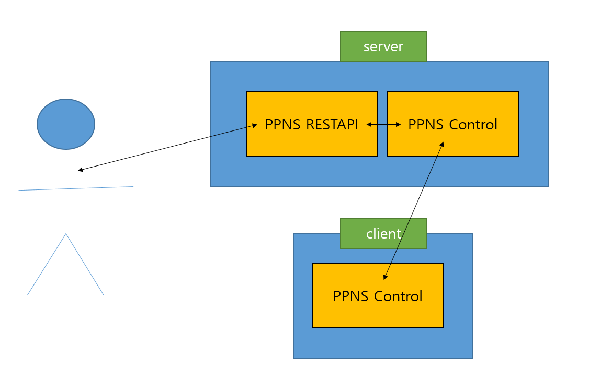
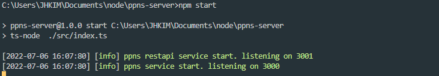
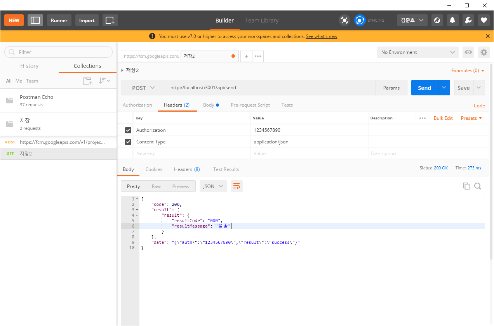
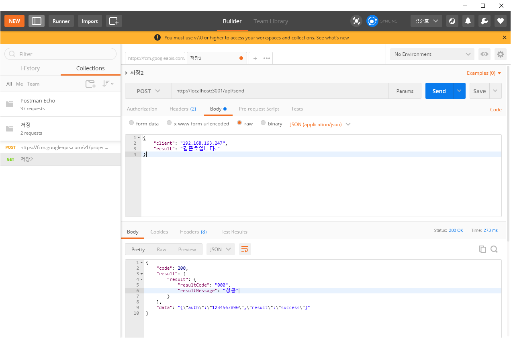

# 
 Public Push Notification Service - PPNS 

What is PPNS?

It's a cross-platform messaging solution that lets you reliably send messages for free. Inspired by Firebase Cloud Messaging, it was developed for development implementation and customization. Firebase cloud messaging systems implement servers as firebase servers, but they allow you to implement servers directly.

 

## Result Video 

 

## Flow chart

 

## Step

1. Installation of the PPNS-only Android application
2. Server start (npm start)
3. Send post to server as below. (check authrizition and client ip)

 

## Example

 

## References

1. https://firebase.google.com/docs/cloud-messaging/fcm-architecture?hl=ko
2. https://github.com/NAVER-CAMPUS-HACKDAY-2017w/common/issues/3
3. https://blog.silentsoft.org/archives/10 - 자바로 클래스간 이벤트 통신
4. https://shihis123.tistory.com/entry/Android-Background-ServiceThread-%EB%B0%B1%EA%B7%B8%EB%9D%BC%EC%9A%B4%EB%93%9C-%EC%84%9C%EB%B9%84%EC%8A%A4-%EC%9C%A0%EC%A7%80%ED%95%98%EA%B8%B0Notification - 안드로이드 백그라운드?
5. https://onedaycodeing.tistory.com/138
6. https://forest71.tistory.com/185

 

## Contact

[Junho Kim](libtv@naver.com)  
[JongSun Park](ahrl1994@gmail.com)

 

## HomePage

Github © [Page](https://github.com/A-big-fish-in-a-small-pond/)

 

## License

this is licensed under [MIT LICENSE](https://github.com/A-big-fish-in-a-small-pond/asterisk-visible-ars).
