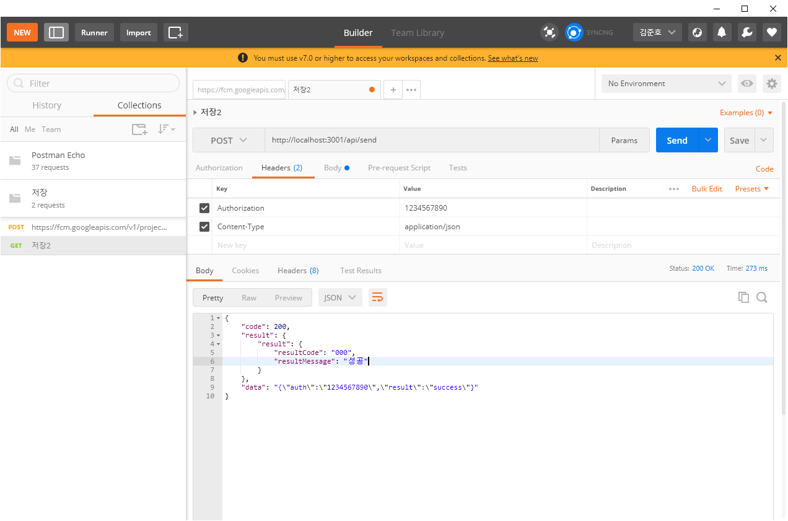

# <div align="center"> Public Push Notification Service - Server </div>

<div align="center">

What is PPNS?

It's a cross-platform messaging solution that lets you reliably send messages for free. Inspired by Firebase Cloud Messaging, it was developed for development implementation and customization. Firebase cloud messaging systems implement servers as firebase servers, but they allow you to implement servers directly.

</div>

<br>

## How to execute

edit const file. <br>
path : ./const/const.ts

```ts
export const AUTHORIZATION = "1234567890"; // your AUTHORIZATION KEY - client same
export const PPNS_CONTEXT_PORT = 3000;
export const PPNS_RESTAPI_PORT = 3001;
```

and start

```sh
cd server
npm install --save
npm start
```

Once the server is turned on android is installed, let's call restapi

```sh
cd server
npm install --save
npm start
```




result data is below;

```json
{
    "code": 200,
    "result": {
        "result": {
            "resultCode": "000",
            "resultMessage": "성공"
        }
    },
    "data": "{\"auth\":\"1234567890\",\"result\":\"success\"}"
}
```

<br>

## Contact

[Junho Kim](libtv@naver.com) <br>
[JongSun Park](ahrl1994@gmail.com)

<br>

## HomePage

Github © [Page](https://github.com/A-big-fish-in-a-small-pond/)

<br>

## License

this is licensed under [MIT LICENSE](https://github.com/A-big-fish-in-a-small-pond/asterisk-visible-ars).
